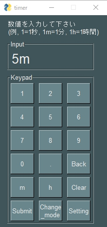

# 作ったものについての簡単な説明

<h3>1.web_puzzle</h3>
職業訓練所のWeb授業で何か作れといわれて作ったコード。 
Canvas APIで画像処理をしている。 
ボタンを押したら画像が順々に表示されるだけのアプリ。  

<h3>2.python_minesweeper</h3>
Pythonの学習用に作ったマインスイーパー。 
GUIモジュールはPySimpleGUIというTKinterのラッパーを使用している。 
特殊な操作はなく、基本的なつくり。 
Fileメニューからリスタートやちょっとした画面設定ができる。  

<h3>3.python_timer</h3>
マクロツールで自分用に作ったタイマースクリプトをPythonにリエンジニアリングしたもの。 
GUIモジュールはPySimpleGUIを使用している。 
使用方法が独特でtimer_main.pywを実行して3つサブファイル生成後、サブファイルからの実行で起動できる。 
一応ターミナルからでも動いて、<code>python.exe timer_main.pyw <タイトル名:インスタントラーメン> 5m</code>
という風に入力すればGUIをすっ飛ばして起動する。  

<h3>4.web_poker</h3>
JavaScriptを忘れないために書いたもの。1人だけのポーカー。 
仕組みも操作もシンプルで、ボタンをポチポチするだけ。 
今までのの反省点を踏まえて書いたので、読みやすくなっているはず。  

<h3>以下、サンプル画像</h3>
<table border="0">
  <tr>
    <td>sample_web_puzzle </td>
    <td>sample_python_minesweeper </td>
    <td>sample_python_timer </td>
    <td>sample_web_poker </td>
  </tr><tr>
    <td></td>
    <td></td>
    <td></td>
    <td></td>
  </tr>
</table>

※使用している画像は著作権フリーの物を使用しています
